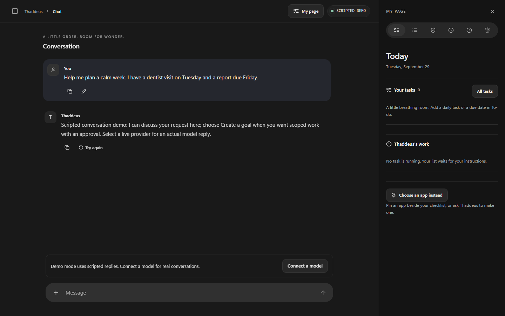

# Thaddeus 2.0

A local-first personal assistant for Windows preview, under development.
It provides conversation, saved work, scheduled actions, connected tools and
inspectable, approval-bound plans. An isolated worker is optional for research
tasks; the ordinary chat and schedule host runs locally.
ASP.NET Core 10, React/TypeScript, SQLite, and ordinary Markdown. Original temporary
pixel raven; no GPU, account key, or model download required for the scripted demo.



**Preview, not production-ready or security-audited.** The source quickstart uses
an explicitly simulated provider until you connect a model. The owner's current
Windows preview is configured for Luna High through a separate development bridge;
that bridge and its credentials are not included in portable packages. A successful
write means the exact approved bytes were read back and hashed, not that every
claim in the plan is true.

The local host owns the study, model and connector boundaries, permissions,
schedule, results and credential custody. A separate isolated worker can be
enrolled for research tasks. The browser/PWA can open on other devices connected
to a supported host; this does not make those devices standalone hosts.
The Docker Sandboxes adapter remains unqualified. An explicitly selected QEMU
preview has Windows WHPX and Linux KVM workflow evidence; it is not an automatic
fallback or a claim of complete security qualification. A macOS worker remains open.
See [current implementation status](docs/DEVELOPMENT_STATUS.md) and the
[release acceptance matrix](docs/MVP_DELEGATION_ACCEPTANCE.md). Earlier milestone
audits do not certify the current Windows preview.

## Current Windows preview

The September 27 local release candidate is **G**, an unsigned Windows x64
portable preview at `artifacts/portable-windows-preview-20260927-r1/thaddeus-win-x64`.
Its stock launcher is **Start Thaddeus.cmd**; it opens the default study at
`%LOCALAPPDATA%\Thaddeus2`. Its exact source, checksum, checks and release gates are
in the [publication handoff](docs/PUBLICATION_HANDOFF.md). The separate local
`artifacts/public-readiness-20260927/Start-Acceptance.cmd` opens a fictional study
at `http://localhost:5479`, preserving existing data. F and E remain preserved;
no owner host was listening at localhost:5279 during the September 27 audit.
These `artifacts/` paths are local acceptance files, not files in the Git checkout
or the older GitHub prerelease. See the
[exact candidate and acceptance ledger](docs/NON_NOTIFICATION_MVP_HANDOFF.md) and
[presentation walkthrough](docs/PRESENTATION_WALKTHROUGH.md) before demonstrating.
Publication is paused. Fresh-user setup, a Google revocation/reconnect check,
Chrome interruption recovery and final normal-desktop notification acceptance
remain separately tracked in the [acceptance matrix](docs/MVP_DELEGATION_ACCEPTANCE.md).

## Source development launch

Prerequisites: .NET SDK 10.0.203 (compatible patch roll-forward), Node 22, npm.
From the repository root:

```powershell
./scripts/start.ps1
```

```sh
sh scripts/start.sh
```

Open http://localhost:5179. Read `.data/host-key.txt` locally and paste its contents
into the unlock form. This is a secret: do not share it or put it in a URL. Each
browser receives a revocable HttpOnly session. Nothing installs an always-on service.

For a self-contained Windows development package, use `scripts/publish-dev.ps1`.
Its `Start Thaddeus.cmd` launcher opens the study using a short-lived login link
and keeps private data outside the application folder. See
[Windows launcher setup and current limits](docs/WINDOWS_LAUNCHER.md).

[Portable development archives](docs/PORTABLE_PACKAGES.md) also bundle the runtime
and web client for Windows x64, Linux x64, Intel Mac and Apple silicon Mac. Local
checks verify extracted packages on their actual target architecture; the hosted
workflows remain disabled. A separate combined publisher packs an existing
Windows/Linux x64 host and pinned worker into one ZIP without staging another
guest disk. macOS and Linux use a foreground terminal launcher. Signing, consumer
installation, a macOS worker and broader Linux qualification remain open.

The older owner-review Windows build is the private
[v0.1.0-preview prerelease](https://github.com/raydeStar/sir-thaddeus-2/releases/tag/v0.1.0-preview).
It is not package F. The current local package's exact source, checksum,
evidence and remaining gates are in the [release handoff](docs/NON_NOTIFICATION_MVP_HANDOFF.md).
The [publication handoff](docs/PUBLICATION_HANDOFF.md) keeps the unpublished
materials and historical prerelease separate.

The packaged host provides offline [backup and restore](docs/STUDY_BACKUPS.md)
without a database tool. A restored study is verified in a new directory, keeping
the original and later edits intact. Guided app-version selection prepares a
separate study, verifies its chosen app before launch, and provides a direct
return launcher for the original study. **Open restored study** and **Open original
study** transfer between these checked copies from maintenance; saved launchers
remain available. Signed automatic updates remain open.

Choose **Try the fictional weekly plan**, inspect the three selected source notes,
and start. The run pauses for one exact write approval. Approve or deny, open the
saved plan, edit it, and inspect its revision history. **Activity** reconstructs
run summaries from SQLite; each row opens source evidence and complete recorded
events. Close/reopen the browser without cancelling work. The host must remain
running and awake. On restart, unknown in-flight work requires reconciliation.

## Verification

```powershell
./scripts/doctor.ps1
node scripts/check-local.mjs core my-change
dotnet run --project evals/Thaddeus.Lab
# In another terminal while the demo host is running:
cd web
npx playwright install chromium
npm run test:e2e
```

Daily verification runs locally; hosted Actions are disabled and manual-only.
See [local checks](docs/LOCAL_CHECKS.md) for native package/browser checks and saved
evidence. The same Node command works on each supported host.

Shell equivalents: `sh scripts/doctor.sh`, `sh scripts/test.sh`. Browser tests add
fictional test pages and runs; use a disposable demo workspace, not personal notes.
Results go to ignored `artifacts/`; screenshots are emulated browser captures.
The Lab command compares minimal/evidence policies and validation/journal-detail
ablations through the same Runtime, Store, tools, and permissions as the product.
It emits **INCONCLUSIVE** for efficacy: scripted contract cases cannot prove model
lift. The validation-removal negative control deliberately exposes a false success.

The [independent native Lab](docs/NATIVE_LAB.md) now exercises the OpenClaw research
path through the real product API and coordinator. Its explicitly registered
Windows development campaign freezes inputs and budgets, repeats controls and
keeps exact imports separate from independent content checks. Six real-VM cases
passed protocol verification using scripted responses; model efficacy remains
inconclusive. It is opt-in and uses fresh private fixture data.

## Live models

In Settings select OpenAI-compatible, enter the exact model and base `/v1` URL,
choose system credential storage or storage until the host stops, then save and
check discovery. The host retains the key; the worker receives no provider secret.
An existing `Thaddeus__ApiKey` remains supported with a fixed endpoint binding.
See [model connection setup](docs/MODEL_CONNECTIONS.md). HTTP endpoints must be loopback; hosted endpoints
require HTTPS. No silent fallback or automatic model loading. Discovery is not
proof of tool calling. The adapter expects streaming Chat Completions, native
function calls, `reasoning_effort`, and `max_completion_tokens`; incompatible
endpoints fail honestly. Selecting a model does not load it or acquire a shared
GPU lease. The new worker broker refuses local GPU inference until resource
coordination exists; it currently admits the explicitly selected Luna High bridge.

**Verified local-model path:** LM Studio `qwen3.8-27b`, Unsloth Q4_K_S, 32K
loaded context. Ordinary chat and new-app planning use the owner's configured
reasoning mode. Explicit new-app implementation then uses a separately recorded
no-thinking call with strict schema bounds, so code emission does not spend the
entire response budget on hidden reasoning. A live packaged check created and
rendered a playable app in two calls; see [model connections](docs/MODEL_CONNECTIONS.md)
and [artifact apps](docs/ARTIFACT_APPS.md). This verifies the exact local
integration, not general Qwen model quality or every quantization.

**Verified development smoke:** `gpt-5.6-luna`, high reasoning, via the user's
authenticated Codex CLI. Three independent smoke runs each reached approval and
exact-write success in one call; reported aggregate usage was 44,354 input / 2,234
output tokens. Cost unknown. No local model
was called. This is a transport/product smoke, not a paired live efficacy study.

Optional development bridge (not a deployed provider service):

```powershell
$env:THADDEUS_CODEX_EXE = '<absolute path to your installed codex executable>'
node scripts/luna-bridge.mjs
# Then configure compatible / gpt-5.6-luna / high / http://127.0.0.1:5181/v1
```

Conversation sends the last twenty messages and the current message to the saved
provider; it cannot silently read knowledge or execute tools. Create a goal explicitly
selects source notes. Settings can inspect capabilities observed in matching run
receipts. Model discovery alone is not a capability test.

The bridge uses existing CLI auth, ignores user configuration, disables shell and
patch tools, rejects observed tool execution, and returns a structured draft. It
buffers final CLI output into SSE; it does not claim native token streaming. Its
180-second limit is enforced; the CLI output-token ceiling is **not certified**.
Do not treat a subprocess or read-only CLI mode as a hardened security sandbox.
`node scripts/live-smoke.mjs` explicitly starts a live call and approves its fictional
test write; it is never invoked by CI. A failed smoke does not authorize a model switch.

## Secure phone path

The recommended manual path is **Tailscale Serve**, with private device access and
automatically provisioned HTTPS. Follow [the phone setup guide](docs/PHONE_SETUP.md)
at the end of the desktop development cycle. No Tailscale installation, account
sign-in or physical phone setup has been performed for you.

`./scripts/start-phone.ps1` discovers the real MagicDNS hostname after you sign in
and starts an explicitly restricted loopback proxy configuration. The separate
foreground Serve command is shown in the guide. Owner bootstrap and pairing
confirmation require the original loopback host origin. Direct Kestrel TLS is also
available. Real local TLS/pairing/revocation and proxy-boundary tests pass; actual
phone installation, reconnect and certificate trust remain pending your device.

## Privacy and limits

`.data/` contains the ledger, sessions, access key, knowledge, revisions, the
owner-reviewed `IDENTITY.md`, live `SOUL.md` personality file, and `USER.md` profile. The right profile rail opens all three ordinary Markdown files; the owner can edit the Soul in Settings or ask
for a conversational change such as “be slightly less gloomy”; chat changes show
the exact current and proposed text and require approval. New conversations and
newly prepared work use the saved version. Soul text controls demeanor only and
cannot grant tools or permissions. Conversation may also propose exact reviewed
updates to `USER.md` when the owner states a durable fact or preference. It does
not silently infer sensitive traits, and quoted material cannot update the profile.
No profile file may contain credentials. All three files are
excluded from Git, stored under your OS account, and **not application-encrypted**.
Back it up as private data. Export/deletion are available in Settings; deletion
does not securely erase disk blocks or remove sessions/provider settings.
The service worker caches only the static app shell. APIs use no-store. Documents
are untrusted and raw HTML is not rendered. Only `notes/<slug>.md` and
`plans/<slug>.md` paths are accepted; linked directories/files are rejected.
Local OS administrators and malicious processes with the same filesystem access
are outside this prototype's threat boundary.

| Capability | Status |
|---|---|
| Conversation workspace, Artifacts, explicit To-do/Ideas/saved reading, local Search, collapsible log and animated pixel raven | First UI pass implemented; [review and Feed limits](docs/UI_REDESIGN.md) |
| Real scripted weekly-plan loop; exact approve/deny; edit/revisions | Implemented |
| Durable goals/events, cursor SSE, two-browser decisions, inspection replay | Implemented |
| Single-host lock, per-run exclusion, stale approvals, reconciliation | Implemented with transactional content/revision intent and explicit projection recovery |
| Call/tool/repair/time budgets and per-call output ceiling | Implemented; endpoint must honor output ceiling |
| Aggregate token admission and observed provider diagnostics | Implemented; strict mode rejects uncertified providers; monetary cost unknown |
| Hosted-compatible adapter; Luna High development smoke | Implemented / smoke verified |
| General conversation | Live replies, persisted context, background tasks, artifact actions and [public link reading](docs/CHAT_WEBSITE_READING.md) |
| Agent tool registry/MCP | Authenticated scoped MCP for OpenClaw research; Chat supports owner-registered remote Streamable HTTP MCP tools with host-held credentials and exact review. Google Gmail/Calendar use the same provider-neutral broker with Desktop OAuth, account/scope status, background refresh, stable bounded REST reads, separate read/send permission choices, and an exact Gmail send adapter. Local `stdio` packages and arbitrary provider OAuth flows remain deferred. |
| Activity for direct edits | Human-edit rows, exact read-back, revisions and recovery receipts |
| Phone pairing/auth/revocation and HTTPS configuration | Real local TLS and proxy tests passed; physical device pending |
| Lab comparison / ablations / negative cases | Scripted suite and frozen 12-run Luna comparison completed; efficacy inconclusive |
| Scheduling and delegated work | Durable one-shot reminders/email, weekday briefs, and connector-neutral read-only inbox watches use the same host-side due-work pump, restart recovery, bounded grants, versioned controls, missed-time policy, and retained outcomes. Relevant reminders, briefs, and inbox-watch results use the Windows notification interface while durable in-app results remain authoritative. The host must remain awake. The current Windows candidate is active and owner-authorized live Gmail and Calendar reads passed. Fresh-Windows-user, delayed-send, recurring-workflow, inbox-watch, and current-package native-notification acceptance remain open. See the [acceptance ledger](docs/MVP_DELEGATION_ACCEPTANCE.md). |
| Subagents, always-on service installation, general plugin marketplace, native apps | Deferred |

See [reuse decisions](docs/REUSE_LEDGER.md), [architecture and threat boundaries](docs/ARCHITECTURE.md),
[verification evidence](docs/VERIFICATION.md), and [next work](docs/BACKLOG.md).
Original project code has no selected open-source license. Dependency licenses
remain their respective owners'; see [third-party notices](docs/THIRD_PARTY.md).
